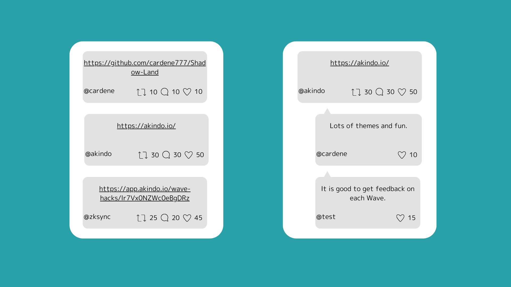
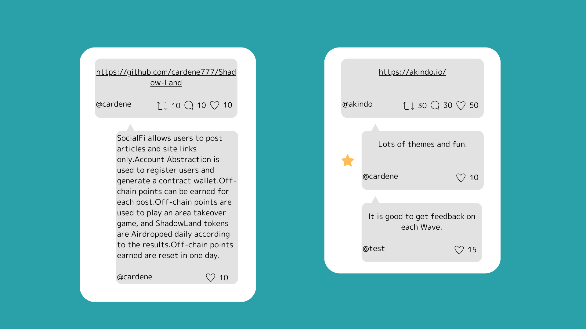
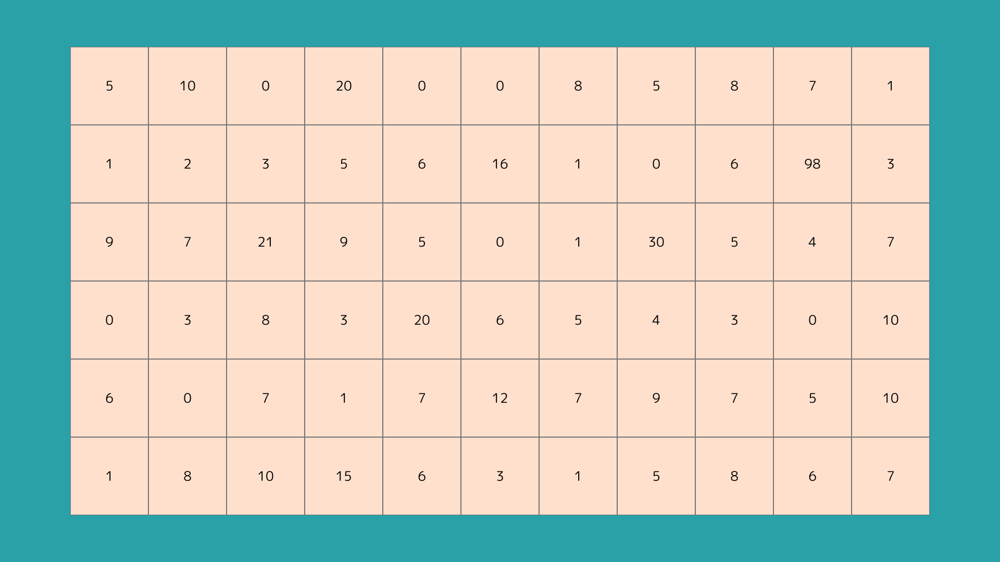
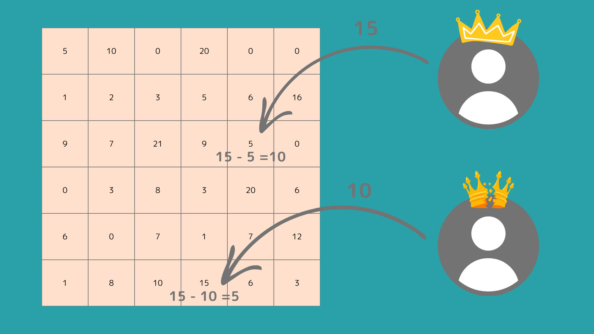

# ShadowLand

## 概要

- 記事やサイトのリンクのみを投稿できるSocialFi。
- ユーザー登録にはAccount Abstractionを使用して、コントラクトウォレットを生成。
- 投稿に応じてオフチェーンポイントを獲得できる。
- オフチェーンポイントを使用してエリア奪い合いゲームを行い、その結果に応じてShadowLandトークンが毎日Airdropされる。
- 獲得したオフチェーンポイントは1日でリセットされてしまう。

## コンセプト

- TwitterなどのSNSにおいて、有益な情報のみを受け取りたい場合がある。
- TwitterなどのSNSでは、特性上くだらない情報や受け取りたくない情報が流れてきてしまう。
- これを解決するために、記事やサイトのリンクのみ投稿できるSNSを作成する。
- リンクのみの共有のため、くだらない情報が流れてくることもなく有益な情報を受け取ることができる。
- もちろんその分通常の投稿ができないが、その部分はTwitterやFarcasterが担うため問題ない。
- また、ただ投稿するだけでなく簡単なゲームを導入することで投稿の意欲を掻き立て、投稿やコメントをしてくれるユーザーへの還元をしていく。

## SocialFi

### 投稿とコメント

- ユーザーは記事やサイトのリンクのみ投稿することができる。
- 投稿に対しては、「re-share（再共有）」、「good（いいね）」、「comment（コメント）」ができる。
  - コメントには、「good（いいね）」もできる。
- コメントでは、何を投稿しても問題ない。
- 投稿やコメントに対して投げ銭やオフチェーンポイントを送ることも可能。

### コメント

- コメントは誰でも行うことができる。
- リンクの共有ユーザーは、投稿に対してその投稿を説明や要約のコメントを紐づけることができる。
  - このコメントは140文字以上である必要がある。
  - この投稿を紐づけた場合、投稿者はオフチェーンポイントを獲得できる。
- 投稿者は自分以外のコメントにスターをつけることができる。
  - スターをつけられたコメントをしたユーザーはオフチェーンポイントを獲得できる。

### ポイント付与

- ポイントの付与は毎日日本時間0時に行われ、毎日日本時間23時59分に消滅する。

## エリア獲得バトル

### ルール

- 各エリアを奪い合うゲーム。
- 現在のエリアの所有者のみ、そのエリアの現在の防御力を見ることができる。
- ユーザーは好きなエリアを選択して、任意の数のオフチェーンポイントを投げる（攻撃力）。
- 現在のエリア所有者の防御力とオフチェーンポイントを投げたユーザーの攻撃力を比較し、その値に応じて以下のようになる。
  - 攻撃力防御力を上回っていれば、攻撃者はエリアを獲得してポイントの差分が防御力に設定される。
    - 図の上のユーザーは防御力「5」のエリアに「15」の攻撃力で攻撃したのでエリアを獲得でき、差分の「10」がエリアの防御力になる。
  - 防御力が攻撃力を上回っていれば、エリアの所有者は変わらず、差分がエリアの防御力になる。
    - 図の下のユーザーは防御力「15」のエリアに「10」の攻撃力で攻撃したので、エリアの所有者は変わらず差分の「5」がエリアの防御力になる。
  - 防御力と攻撃力が同じなら、エリア所有者は変わらずエリアの防御力は「0」になる。

### ゼロ知識証明

- エリアの防御力はエリアの所有者のみ見ることができ、他のユーザーは防御力を予測して攻撃する必要がある。
- しかし、本当にエリアの防御力が正しいのかを計算するためにゼロ知識証明を使用する。
- 防御力を明らかにせずに攻撃の計算をして、エリアを獲得できたかどうかだけを出力する。

### エリアのリセット

- 毎日日本時間23時59分にエリアの防御力と所有者がリセットされる。
- 毎日日本時間0時にエリアの防御力と所有者がセットされる。
- この時、エリアの所有者はポイント保有量が少ないが、前日コメントを多くしていたユーザーなど一定の基準を満たしたユーザーの中からランダムに選出され、防御力もランダムに割り振られる。
- これにより、ポイントが多いユーザーしか勝てないというのを防ぎつつ、アクティブユーザーに還元チャンスを与える。

## ShadowLandトークン

- ERC20トークン。
