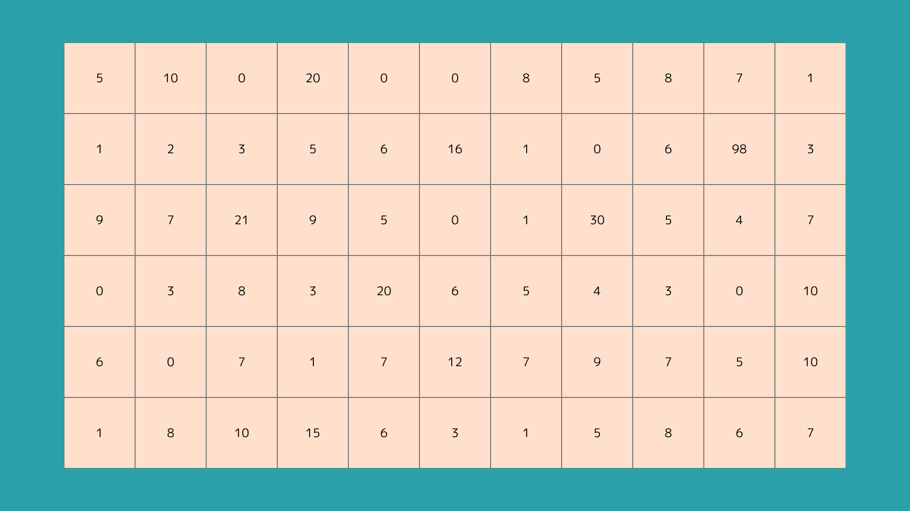
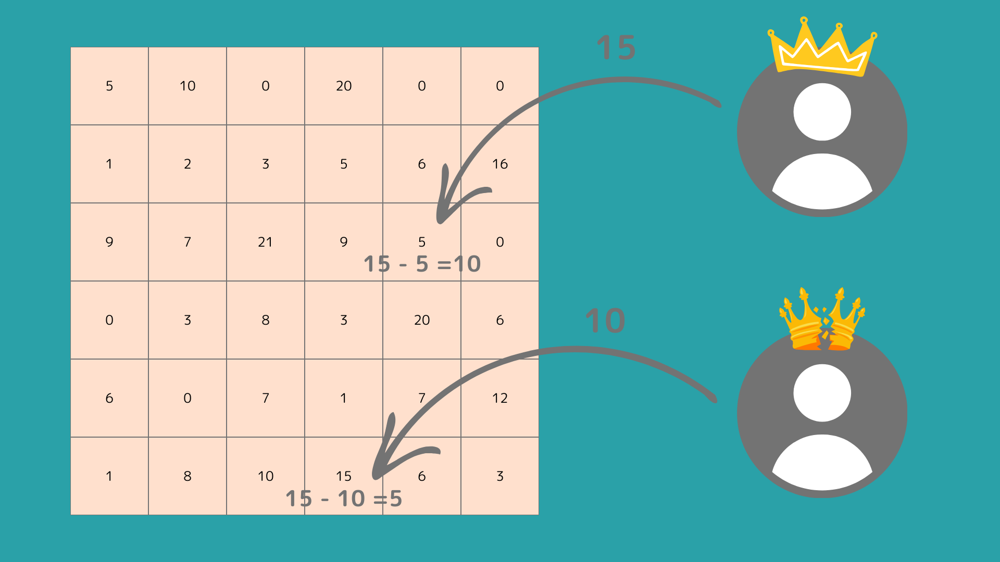

# ShadowLand.

## Overview

- SocialFi that allows users to post articles and site links only.
- Account Abstraction is used to register users and generate a contract wallet.
- Off-chain points can be earned for each post.
- Off-chain points are used to play an area takeover game, and ShadowLand tokens are Airdropped daily according to the results.
- Off-chain points earned are reset in one day.

## Concept

- On social networking sites such as Twitter, you may only want to receive useful information.
- On social networking sites such as Twitter, information that is trivial or information that you do not want to receive will flow through due to their nature.
- To solve this, create a SNS where only links to articles or websites can be posted.
- As only links are shared, no trivial information will flow and useful information can be received.
- Of course, this means that normal posting is not possible, but this is not a problem as Twitter and Farcaster will take care of that part.
- In addition, the site will motivate users to post by introducing simple games, rather than just posting, and rewarding users for posting and commenting.

## SocialFi

### Posting and commenting

- Users can only post articles or links to the site.
- They can 're-share', 'good' and 'comment' on posts.
  - Comments can also be 'good'.
- In comments, it does not matter what you post.
- It is also possible to send throw-aways or off-chain points for posts and comments.

### Comments

- Comments can be made by anyone.
- Users who share a link can tie a comment to a post that describes or summarises the post.
  - This comment must be at least 140 characters long.
  - The contributor earns off-chain points for linking the post.
- Contributors can star comments other than their own.
  - The user whose comment is starred earns off-chain points.

### Points awarded

- Points are awarded daily at midnight Japan time and expire daily at 23:59 Japan time.

## Area acquisition Battle

### Rules

- A game in which players compete for each area.
- Only the current owner of an area can see the current defence of that area.
- The user selects an area of their choice and throws any number of off-chain points (attack power).
- The current defence of the area owner is compared to the attack power of the user who threw the off-chain point, as follows.
  - If the attacker's defence exceeds the attacker's defence, the attacker wins the area and the difference in points is set to the defence.
    - The user in the upper part of the diagram attacked an area with a defence of '5' with an attack power of '15', so he gains an area and the difference of '10' is set to the defence power of the area.
  - If the defensive strength exceeds the attack strength, the owner of the area remains the same and the difference becomes the defensive strength of the area.
    - The user at the bottom of the diagram attacked an area with a defence of '15' with an attack of '10', so the owner of the area remains the same and the difference of '5' becomes the defence of the area.
  - If the defence and attack power are the same, the area owner remains the same and the defence power of the area becomes '0'.

### Zero Knowledge Proof

- Only the area owner can see the defensive strength of the area, while other users have to predict the defensive strength to attack.
- However, a zero-knowledge proof is used to calculate whether the defensive strength of an area is really correct.
- Calculate the attack without revealing the defensive force and output only whether the area has been won or not.

### Reset area

- The area's defences and owner are reset at 23:59 Japan time every day.
- Defence and owner of the area are set at 0:00hrs CET every day.
- At this time, the owner of the area is randomly selected from users who have less points but meet certain criteria, such as users who had more comments the previous day, and the defences are also randomly assigned.
- This prevents only users with the most points from winning, while giving active users a chance to give back.

## ShadowLand Token

- ERC20 Token.
